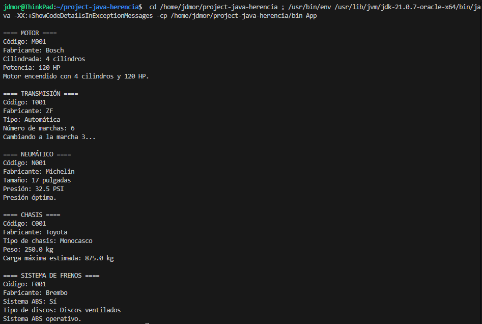

# Proyecto Java Herencia

## Descripción

Este proyecto demuestra el uso de la herencia en Java mediante la modelación de la clase ComponentesVehiculares. Cada componente (Motor, Transmisión, Neumático, Chasis, Sistema de Frenos) hereda de una clase base común.

## Jerarquía de Clases

```
ComponenteVehicular
├── Motor
├── Transmision
├── Neumatico
├── Chasis
└── SistemaFrenos
```

## Estructura del Proyecto

- `src/Models/`: Contiene las clases del modelo.
- `src/App.java`: Clase principal para pruebas y demostración.

